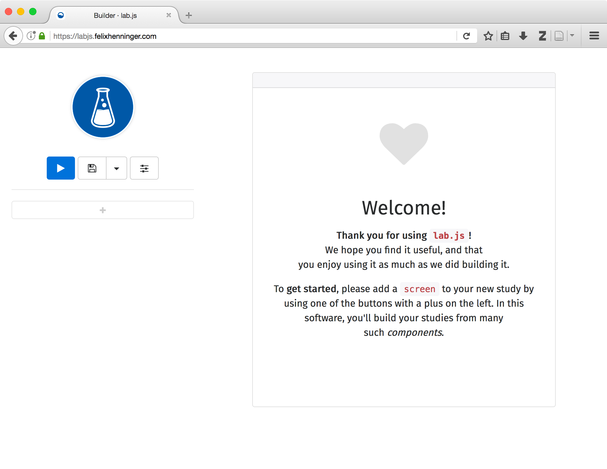
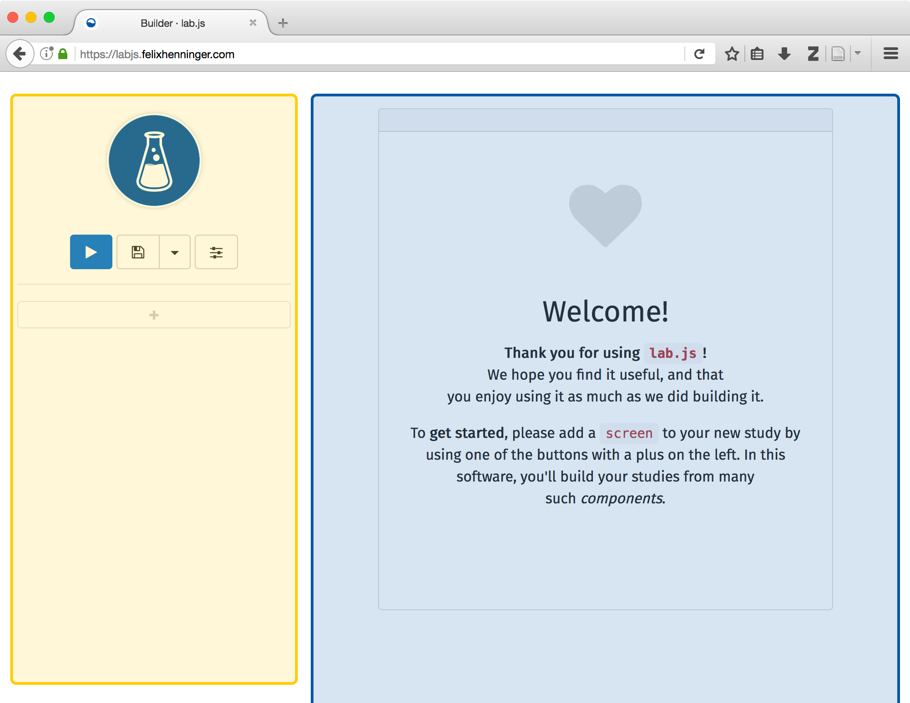
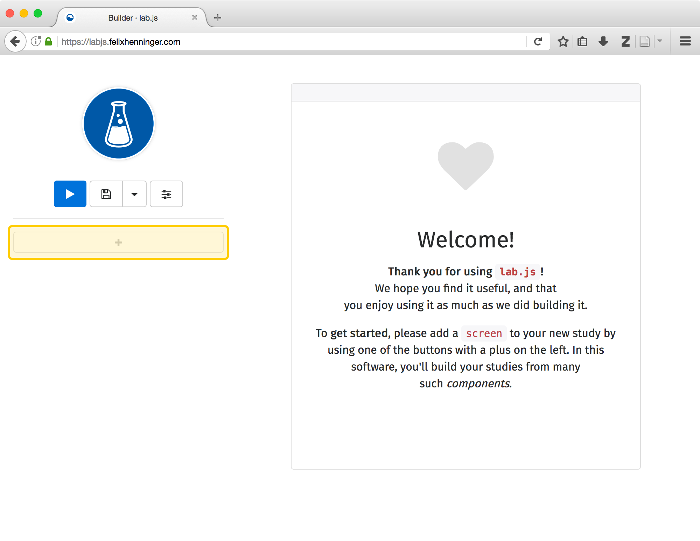
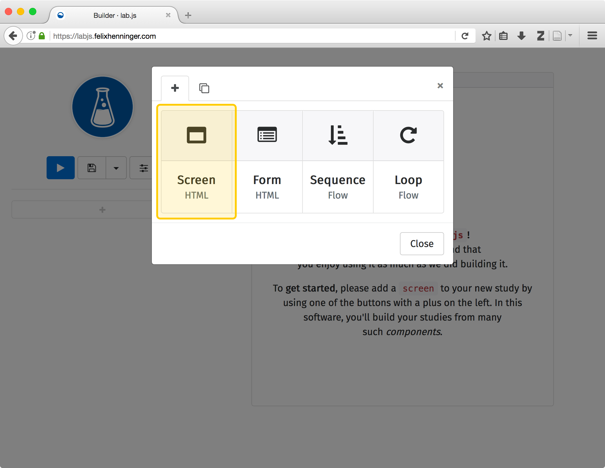
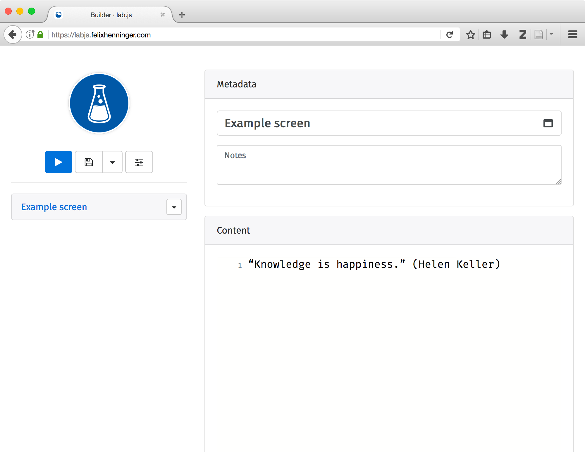

Let's take a look around
========================

.. sidebar:: Browser support
  :subtitle: **You'll need an up-to-date browser** to make full use of the interface.

  We recommend `Firefox`_ or `Chrome`_ in their most recent version. Both update automatically, so if you're using either one already, you should be all set.

  The **studies you build will run on a much wider range of browsers** and devices without problems -- it's just the interface that needs some `very recent features`_. We're doing cutting-edge stuff, here!

  .. _Firefox: https://getfirefox.com/
  .. _Chrome: https://www.google.com/intl/en/chrome/
  .. _very recent features: http://caniuse.com/#feat=serviceworkers

In this section, we'll take a look around the interface, and very briefly visit the different sections. By the end, you'll know the most important bits, and we'll build on that in the following parts.

.. |clearfloat| raw:: html

  

.. raw:: html

  

Accessing the builder
---------------------

You can **open the builder** from any modern browser by navigating to ``https://labjs.felixhenninger.com``. Once the page has loaded, you're all set to start experimenting -- no further installation is required!

.. _OpenSesame: http://osdoc.cogsci.nl/

|clearfloat|

----

Basics of the interface
-----------------------

The builder uses a **two-pane layout**: On the left, you'll see the study structure and the main functions; this is where we'll break down the experiment into individual parts. We'll use the right-hand-side in a moment to specify the details for each of these parts. If you've used dedicated experimental software like `OpenSesame`_ before, this structure might be familiar to you.

|clearfloat|

.. rst-class:: table-img

  +--------------+--------------+
  | |fig1|       | |fig2|       |
  +--------------+--------------+

|clearfloat|

----

Getting started
---------------

Right now, the area on the left below the toolbar is empty, as is our study. To start making it more useful, we'll need to **add parts**. You can add a new piece to the study by clicking on the gray plus button on the left-hand side. Having done so, a dialogue will ask you what kind of new thing you'd like to include. For now, we'll start with a **Screen**, which is the simplest piece available. Most of our steps will start by adding this or one of the other building blocks to our study. If you like, you can think of this procedure like assembling a presentation from individual slides.

|clearfloat|

.. rst-class:: table-img

  +--------------+--------------+
  | |fig3-left|  | |fig3-right| |
  +--------------+--------------+

|clearfloat|

After clicking on the new screen on the left, the right pane shows us all the options and settings we can apply to **customize its behavior**. To help us keep track once we start adding more content, it's a good idea to give the screen a **descriptive title**. I'll call mine 'Example screen' for now.

Now that you've added something, you can **preview your study** by clicking the bright blue button on the left of the toolbar. Doing so opens a window in which you can see your nascent study (you might have to allow popups first). However, there's not much visible yet -- if you squint just a little, you might be able to make out a gray border: That's where our content, the stuff we're going to show to our participants, is currently missing!

----

Adding content
--------------

Of course, we won't want to keep our study this bleak for long, so our next step is to **add screen content**. In the most basic case, we could add some text to the big empty content area in the screen settings. For example, you could insert ``hello world`` if you like (but feel free to choose something more inspiring).

.. rst-class:: table-img

  +--------------+
  | |fig4|       |
  +--------------+

You can go beyond the raw text by adding ``HTML`` to your content. In a nutshell, ``HTML`` embeds additional information alongside the actual content. Specifically, it conveys the semantic meaning of any piece of information; for example, it might indicate that a piece of text belongs to a heading as opposed to a paragraph, which parts are emphasized, and more generally, how the page is structured. This data is included in *tags*, short snippets of code that are enclosed in angle brackets. These often come in pairs, one at the beginning and one at the end of the content they refer to.

We'll get into more detail with regard to ``HTML`` later, for now, you can see that it affects the display by marking the main content as such (we've also added some line breaks for proper formatting in the example):

.. code-block:: html

  <main>
    We shall not cease from exploration  
    And the end of all our exploring  
    Will be to arrive where we started  
    And know the place for the first time.  
    (T. S. Elliot)
  </main>

----

Recap
-----

**With that, you know how the basics of the interface work!** Specifically, you should have seen

* How the interface is divided into sections
* How to add parts to an experiment
* Where to find settings for each part

Of course, a more useful study will consist of a few more parts, but we'll get around to that in the next section. Grab a coffee, and we'll see you there!
