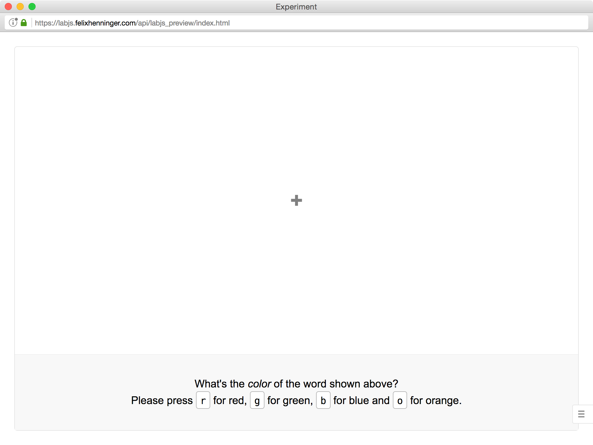
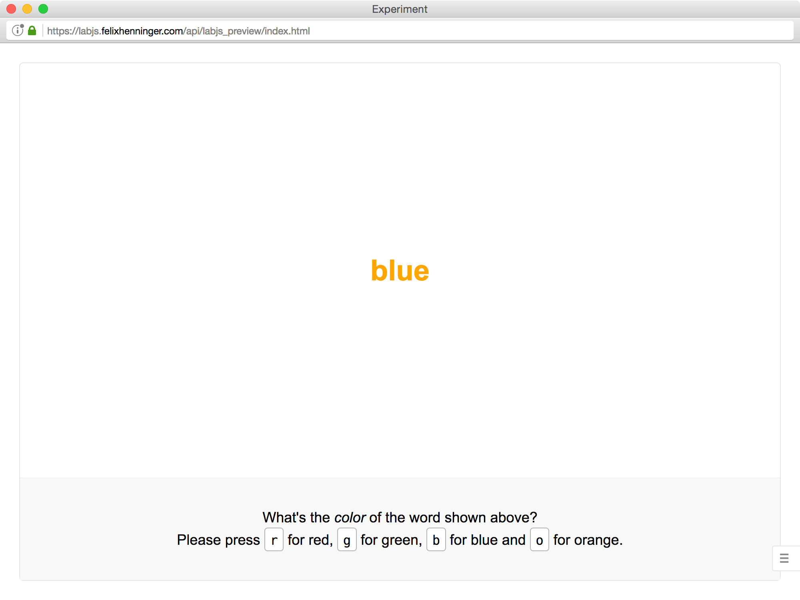
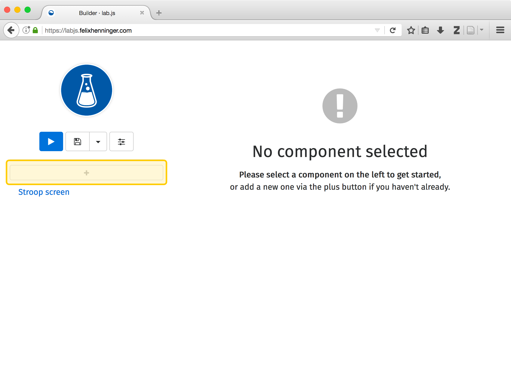
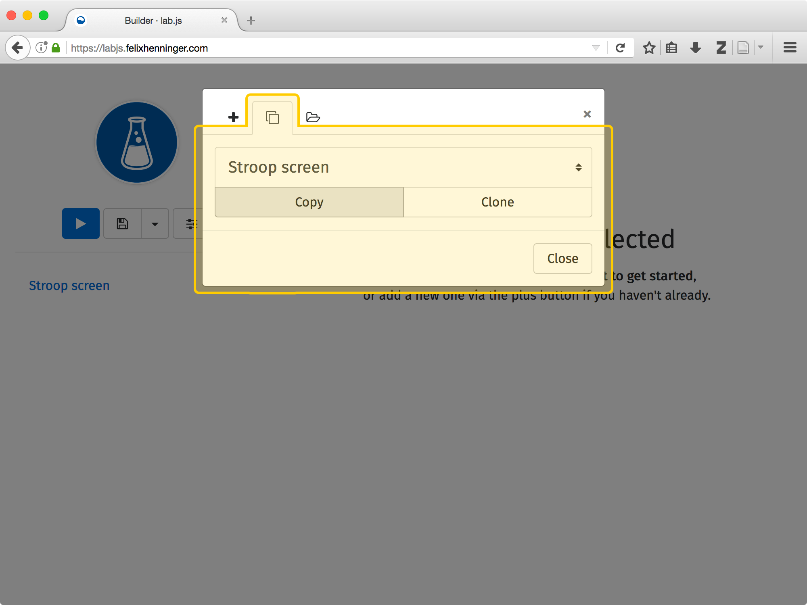
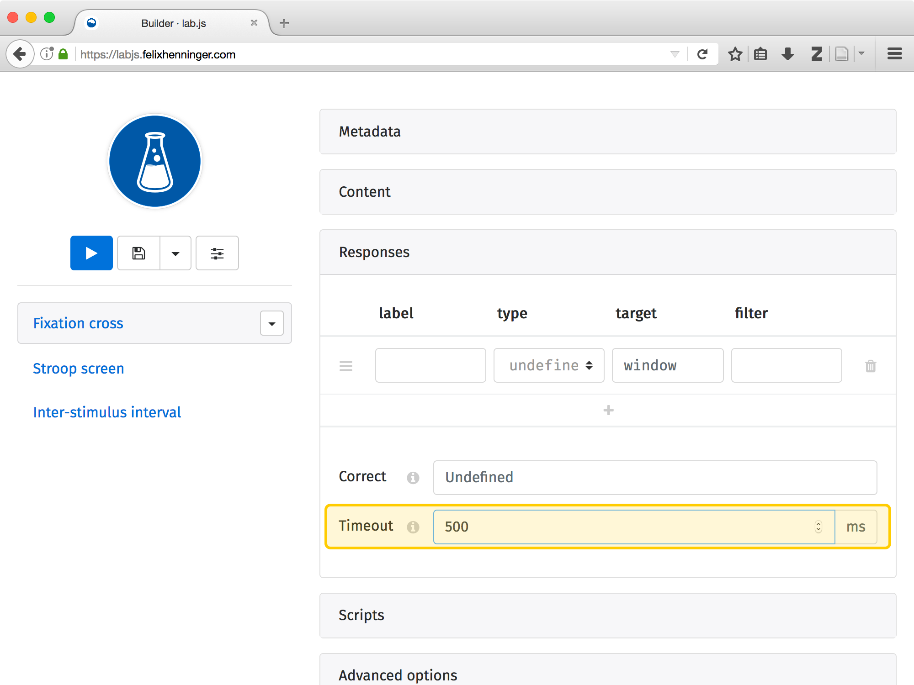
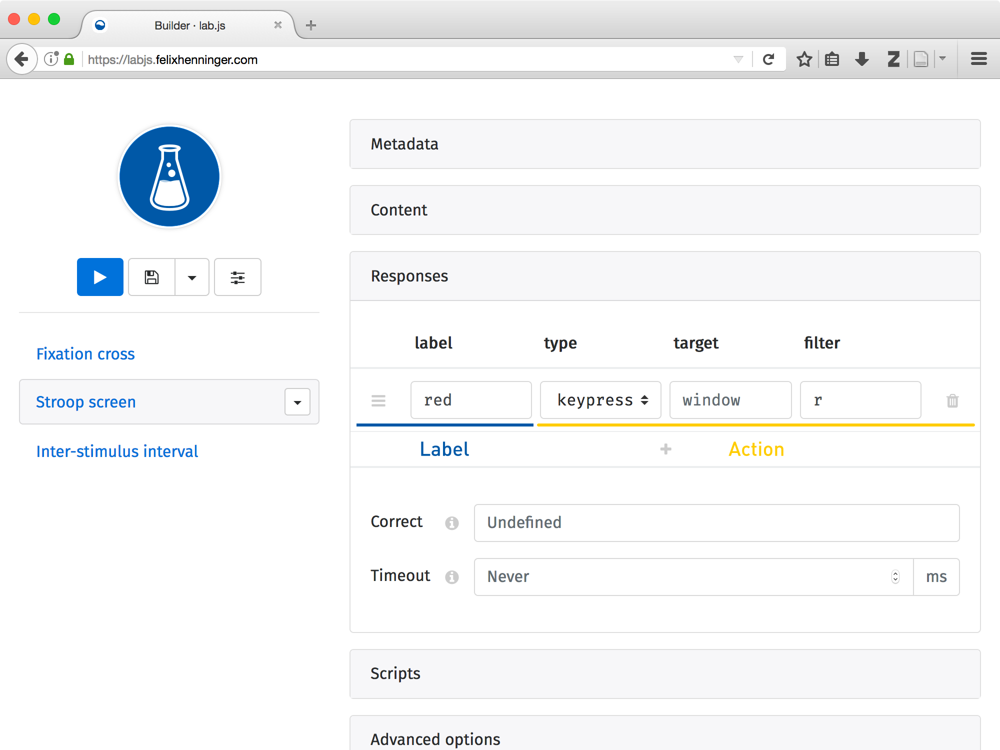
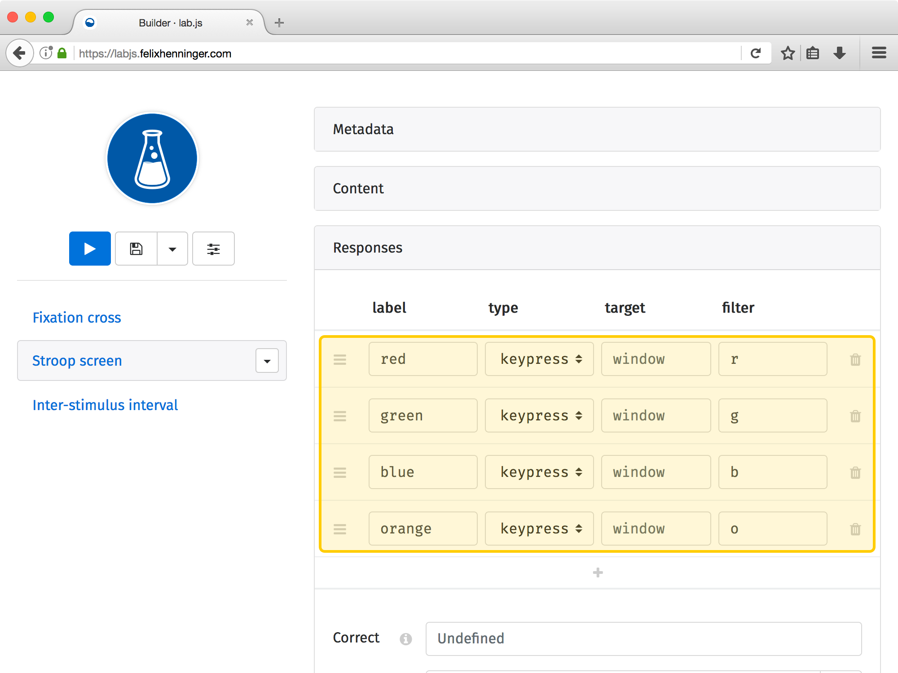

The end is nigh (responses and timeouts)
========================================

In this part, we'll discuss how to move from one screen to the next -- either in response to a participant's action, or automatically because a time limit was reached. Starting from the single screen we've created in the last part, we'll use this to construct an entire trial sequence.

.. |clearfloat| raw:: html

  

.. raw:: html

  

----

Copying screens
---------------

The one screen we've built so far is a good start, but as we progress toward an entire study, we'll want to show multiple screens in sequence. Creating those screens is the first step: Our goal will be to create all screens needed for a full trial, starting with a fixation cross, followed by the main screen we've already constructed, and finally a blank inter-stimulus interval.

|clearfloat|

.. rst-class:: table-img

  +--------------+--------------+--------------+
  | |fig1a|      | |fig1b|      | |fig1c|      |
  +--------------+--------------+--------------+

|clearfloat|

The two new screens will be very similar in content to the last -- for the **fixation cross**, we'll show a plus instead of the word that was previously at the center, and change the color setting to ``gray``. For the blank **inter-stimulus interval**, we'll remove the main screen content entirely. You might decide differently, but we've found it helpful to leave the footer information unchanged throughout, so as not to distract participants by additional changing information.

To realize this trial structure, we'll need to **add new screens** in the structure on the left. The add buttons are still there, but they are hidden above and below the existing screen component -- take a moment to find them with your cursor.

Where you choose to add a new component relates to its **temporal order**: Components higher up will appear before those below -- the study progresses from top to bottom. By selecting a particular position for the new component, you'll define when it appears.

|clearfloat|

By clicking on one of the add buttons, the **'new component' pop-up** will appear as before. Here, you could include two new blank screens and copy-paste the ``HTML`` content we created earlier. However, if you're feeling crafty, you might find it helpful to change to the second tab from the bar at the top. From there, you can select an existing screen to **copy** (be sure not to **clone** it -- that would synchronize all changes you make between the original and the new screen). Please take a moment to copy the screens, and change their titles and content before moving on!

----

Setting timeouts
----------------

If you preview the study in its current state (try it!), you'll find that the initial screen (the fixation cross) is shown, but the study gets stuck, and doesn't advance beyond that point. This is because we haven't yet defined a condition for it to move on.

The simplest way of moving from screen to screen is to leave it to the study to advance automatically after a fixed delay. This **timeout** is set in the screen options on the right, below the content -- please scroll down, or click on one of the gray headings to collapse the panes you aren't using. The timeout field accepts a number in milliseconds, which you are free to set -- we've found that 500ms for the fixation cross, and an inter-trial-interval of 1000ms, usually fit the bill.

If you now take another look at the study in preview mode, you should find that it advances from the first screen to the next (though you might miss the transition, depending on how fast you can switch windows!).

----

Collecting responses
--------------------

Automatically moving on to the next screen via timeouts is fine and dandy, but in most studies you'll want to react to user input in between, and collect **responses** to the content you show onscreen. That's what what we'll use for the stroop screen.

In ``lab.js``, we split a response into two parts, a **label** that represents any particular response, and the **action** associated it. For example, for our Stroop screen, we might say that a participant responded ``red`` (label) by pressing the ``r`` button on her keyboard (action).

In the **responses pane** above the timeout, you'll find a tabular structure in which every row represents a single response, and the columns contain the different parts. The first column is for the **label** assigned to any particular response, say ``red``. Moving to the right, the next column defines the **type** of action we're looking for, most likely a ``keypress``. The **target** would allow us to restrict input to specific parts of the screen, but since we would like to collect key presses no matter where they occur in the window, we're going to leave this field in its default state. The **filter** column is more relevant for our purposes: It's where we can focus on only those keys that represent the response we're looking for. You could, for example restrict the response to the ``r`` key by adding that letter as a filter.

.. rst-class:: table-img

  +--------------+
  | |fig4|       |
  +--------------+

To complete our set of responses, you'll want to add all possible colors by using the plus button below the grid. Take a moment to go through all colors you're going to use!

.. hint::

  **Responses and timeouts are not mutually exclusive**: In some cases, you might well define both -- whichever comes first will determine when a particular screen is completed.

----

Recap
-----

**Having added timeouts and responses to the respective screens, we've now made the study fully interactive**. If you open it in preview mode, you should be directed to the stroop screen, which remains visible until you press one of the keys that correspond to a permitted response. This should lead you to the final, blank screen, where the study is stuck once more. We'll fix that in the next part!

