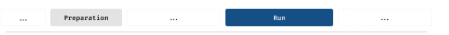
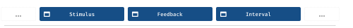
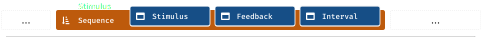

Building a working study
========================

.. raw:: html

  

.. role:: blue

.. image:: study/1-stroop-incongruent.png
   :alt: Stroop task screenshot
   :width: 45%
   :align: right
   :class: screenshot

**This is where we build our first working study!** Specifically, we're going to create an experiment that demonstrates the *Stroop effect*. This effect describes the interference between a written word's content and its visual characteristics: `John Ridley Stroop <https://en.wikipedia.org/wiki/John_Ridley_Stroop>`_ demonstrated that naming the color of a word is harder (takes longer) when the word denotes a different color. An example for such an *incongruent* display might be the word :blue:`red`. Conversely, if the word and color correspond (are *congruent*), participants can perform the task faster.

.. contents:: Contents
  :local:
  :depth: 1

----

Picking back up
---------------

This section builds on the previous one, in which you `downloaded the starter kit <https://github.com/FelixHenninger/lab.js/releases>`_ and took at first look how a minimal 'experiment' was constructed from individual components. You also kicked off the study by adding or uncommenting ``study.run()``. We'll build upon the same code, so please make sure you have the files and a text editor handy.

If didn't go through the initial steps and don't feel confident looking at the starter kit code, please go back and take a quick look. You're always welcome to `reach out if you need help <https://lab.js.org/resources/support/>`_ right now or in any of the following steps.

With that, let's get going!

----

Thinking about a study's structure
----------------------------------

**When we build our studies, we'll think about them in a particular way: As a sequence of individual building blocks. What does that mean?**

Every *component* performs a particular function -- it might show some information onscreen, play a sound, or do some processing in the background. Each component *prepares*, often at the beginning of the experiment, readying for its task, and will *run* later, to perform its main function.

As we just discussed, every component's moment in the spotlight is when it runs. This will very often mean showing some information for a fixed amount of time, or waiting for the participants' response. A typical experiment will often consist of many such components strung together, for example like this:

When we build experiments, components will not only be responsible for presenting stimuli and collecting responses: We will also use different components to tie the structure of our experiment together. For example, the stimuli above are shown sequentially, and therefore together constitute a *sequence*. Accordingly, we'll use a *sequence component* to group them together.

In many ways, a sequence component behaves exactly as a standard component would: It prepares by signaling to all nested components to get ready themselves, and it runs by running them in sequence.

A sequence differs from a stimulus component in that it does not provide any new information to the viewers. Instead, it is in charge of *flow control*: It makes sure that other components run when they are supposed to. These *nested components* can then do the actual work of presenting information, or they might themselves organize the flow of yet another set of components.

We'll always combine both types, presentational components and flow control components, to build studies.

Building a Stroop screen
------------------------

**Knowing what you now know, what might be a good component to start building a Stroop experiment?** We're going to start with the main stimulus display itself, the part that displays the word and color, and collects the response.

First, let's think about how to design the stimulus. For the purposes of this tutorial, we'll use ``HTML`` to tell the browser what we'd like to show onscreen [#f1]_. We'd like to show a word, and give it a color. The syntax required to do this will probably look somewhat like the following:

.. code-block:: html

   

     blue
   

Given this content, let's build a component that will make it visible to the participants by inserting the ``HTML`` syntax into the page. This is the purpose of the :js:class:`html.Screen` component that you may have noticed in the starter kit code. By extending our earlier 'hello world' example, we might create the following snippet::

  new lab.html.Screen({
    content: '
 blue 
',
  })

This creates a new :js:class:`html.Screen` with our content. When it runs, the short ``HTML`` code will be inserted into the page, specifically into the element whose ``data-labjs-section`` attribute is ``main`` (this default can be changed).

There are a few details to note here: First, the screen is constructed using options which are supplied in brackets -- and not only regular ones, but also curly braces. This is because the options are defined by a dictionary (you might also use the term object) which has pairs of keys and values, separated by a colon. Right now, only one option is provided: The content in form of our ``HTML`` string, enclosed in quotation marks to indicate that the browser should treat it as literal text rather than as a command. If we were to add further options, we would need to insert commas between them, a fact that is hinted at by the comma behind content option.
Second, it's worth noting briefly that the the quotation marks around and within the ``HTML`` code are different. This is because the simple quotation marks denote the beginning and the end of the string, whereas the double quotation marks are part of its content. Using single quotation marks within the ``HTML`` code would end the string prematurely and cause an error -- that's something to look out for.

If you've changed the code to correspond to the above example and reloaded the page in your browser, you should see the word blue on the screen, written in red. It's not (yet) as pretty as it could be, but it'll do for the moment: We'll get around to :ref:`styling our study <tutorial/style>` later!

----

Combining screens to build a trial
----------------------------------

In the previous section, we've filled our Stroop screen with the minimal content it needs. In this one, **we'd like to build a single trial with you**, adding more screens, and then teaching the software to move between them.

Right now, your study code will most likely look somewhat like this, in that it consists of a single sequence, containing a single screen::

  const study = new lab.flow.Sequence({
    content: [
      new lab.html.Screen({
        content: '
 blue 
',
      }),
    ],
  })

Let's now expand on that by adding a couple more screens: A fixation cross prior to the stroop screen, and an inter-stimulus-interval thereafter. You can build these by duplicating the Stroop screen code twice, and placing it in front of and below the existing trial screen, defining a sequence of several screens, somewhat like this::

  const study = new lab.flow.Sequence({
    content: [
      new lab.html.Screen({ /* Fixation cross options */ }),
      new lab.html.Screen({ /* Stroop stimulus options */ }),
      new lab.html.Screen({ /* Inter-stimulus interval options */ }),
    ],
  })

Each of these screens differs with regard to its content -- for example, the fixation cross might contain just a single plus sign for the moment, and the inter-stimulus interval might remain entirely empty.

----

Moving between screens
^^^^^^^^^^^^^^^^^^^^^^
If you start the study at this point, you'll see that the study hangs at the fixation cross, and won't continue beyond it. Let's change that!

Setting timeouts
~~~~~~~~~~~~~~~~

What we'd like to happen is for the study to move on from the fixation cross after a fixed amount of time, and do likewise in the inter-trial interval. To implement this, we'll need to add a second option to the respective components, the :js:attr:`timeout <options.timeout>`. This sets a time in milliseconds after which a component ends automatically, and cedes control to the subsequent screen (if there is one). With a timeout in place, you should see the study moving to the stimulus at least.

Defining responses
~~~~~~~~~~~~~~~~~~

On the stimulus screen, we'd like to wait for our participant's decision before moving on. For this to work, ``lab.js`` needs to know about the permissible responses on the screen, which are defined in the :js:attr:`responses <options.responses>` option.

The :js:attr:`responses <options.responses>` map the actions the participant can take onto the meanings they convey. For example, in the Stroop task, participants might press the ``r``, ``g`` and ``b`` keys, corresponding to the the responses ``red``, ``green`` and ``blue``. This mapping is added to the screen settings::

  new lab.html.Screen({
    content: '
 blue 
',
    responses: {
      'keypress(r)': 'red',
      'keypress(g)': 'green',
      'keypress(b)': 'blue',
    }
  })

With this, all parts of your study know when to move on automatically or wait for partipant input, allowing the study to run through a single trial. We'll build on that in the next step!

----

So to recap briefly, **we hope to have shown you how to setup different components and their options, and how to run through different components in sequence**. In the next part, we'll put everything you now know to use and define an experiment that varies information across trials.

----

.. [#f1] This is not the only way to design the display. If you're used to
  writing code that draws shapes and text at exact screen coordinates, don't worry: That is also possible using :ref:`canvas-based displays <reference/canvas>`.

  Both approaches have their advantages and disadvantages: We'll discuss these at a later point. For now, we decided to give up some control over the precise display in return for a simpler method of stimulus construction.
