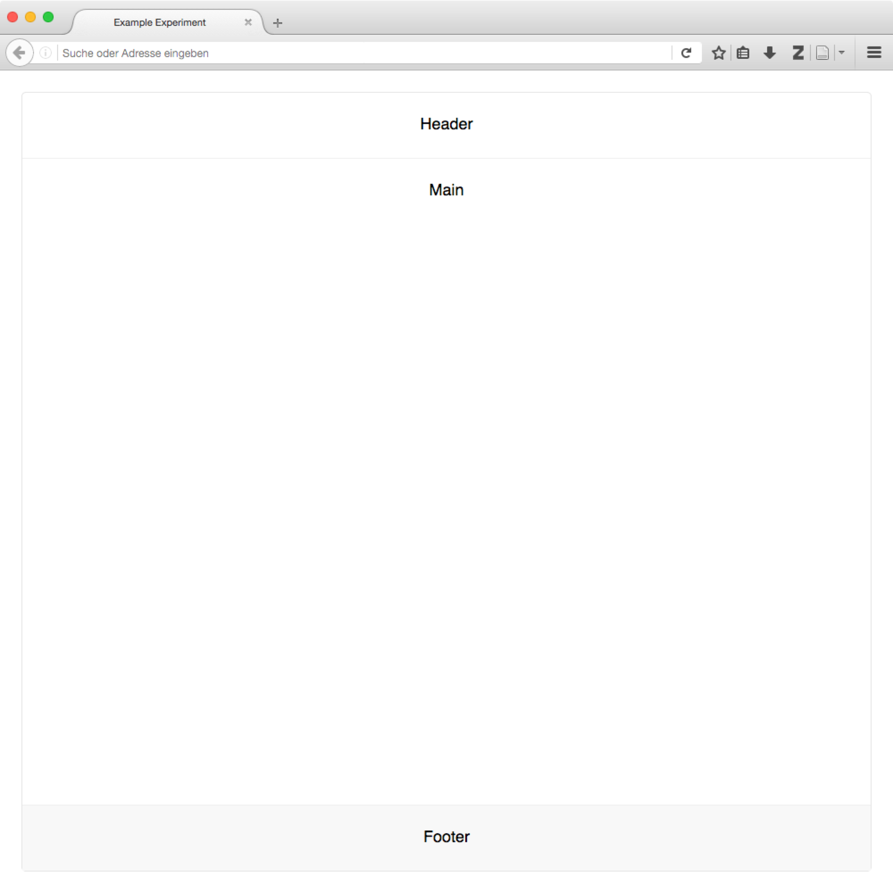
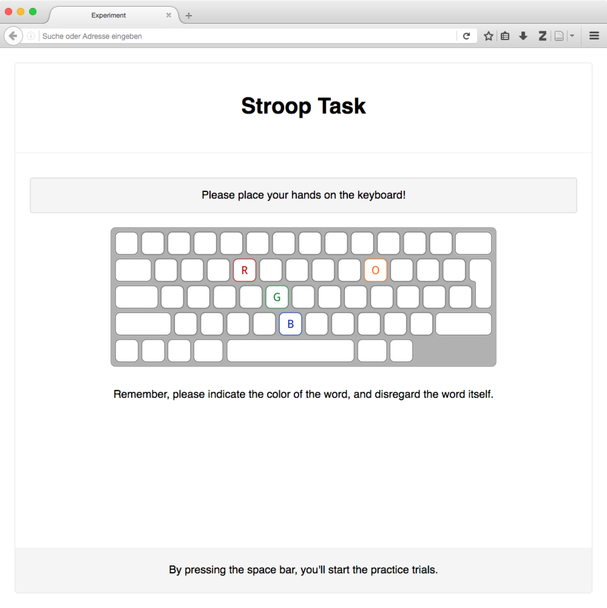

.. _tutorial/style:

Pre-made styles
===============

**Making a study look neat is helpful in several ways: A clear design helps
participants navigate through the study, and it shows the professionalism of its
creators.** There are, of course, many ways to achieve this, and if you have
built web-based experiments before, you might well have a preferred layout that
is tested and proven.

With ``lab.js``, we've included a basic set of styles with the `starter kit`_.
These are provided to get you started quickly, and to save you some hassle when
you're building your first experiment. The following section describes the
styles that are available, and shows you how to apply them.

.. vimeo:: 376720859

.. important::

   **You are in no way bound to the styles provided in the starterkit and
   described here** -- you're very welcome to replace them, or extend and adapt
   them to your needs: These styles are designed to give users a head start,
   and are in no way mandatory.

   **If you notice something that's missing or should be working differently,
   please let us know** -- we're really happy to extend the built-in styles,
   and to make them more useful.

.. _starter kit: https://github.com/FelixHenninger/lab.js/releases/latest

.. contents:: Contents
  :local:

.. The following substitution is necessary for the floating images used below.
   We also add some shadow to the screenshots on this page, to make them look
   a bit more interesting

.. |clearfloat| raw:: html

  

.. raw:: html

  

----

Including the styles
--------------------

.. note::

  If you're working from the starter kit, the default styles have already been
  set up for you -- you're good to go, and ready to `set up your page`_!

  .. _set up your page: #setting-up-the-page

If you've been working on an existing study and would like to use the styles,
please download the latest `starter kit`_ and include the file ``lib/lab.css``
in your project. You'll also need to include a link tag in the ``head`` section
of your document, with a reference to the file:

.. code-block:: html

   <link rel="stylesheet" href="lib/lab.css">

You might need to adjust the path in the ``href`` attribute depending on the
placement of the downloaded style sheet file.

----

Setting up the page
-------------------

Container
^^^^^^^^^

On the most coarse level, all content on the page is gathered inside a
**container**. This element holds all of the content and determines its width.
In the default style, it provides a thin outer border for the content. You can
create a container by applying the ``container`` class to a ``div`` or another
block element:

.. figure:: style/1-container.png
   :alt: Page with just a container div
   :figwidth: 45%
   :align: right

.. code-block:: html

  <!doctype html>
  <html>
  <head>
    <meta charset="utf-8">
    <title>Example Experiment</title>
    <!-- Load styles -->
    <link rel="stylesheet" href="lib/lab.css">
    <!-- Load additional styles and scripts -->
  </head>
  <body>
    <!-- Define the container -->
    

      <!-- Container content -->
    

  </body>
  </html>

|clearfloat|

Page sections
^^^^^^^^^^^^^

You'll often want to subdivide the page into different sections containing
different parts of the visible information. For example, you might want to
include a *header* with your university's logo, a *footer* with contact info or
navigation buttons, and of course the *main* experiment content.

You can achieve this directly by placing ``header``, ``main`` and ``footer``
elements within the container:

.. figure:: style/2-sections.png
   :alt: Screen divided into sections
   :figwidth: 45%
   :align: right

.. code-block:: html

   <!doctype html>
   <html>
   <head>
     <meta charset="utf-8">
     <title>Example Experiment</title>
     <link rel="stylesheet" href="lib/lab.css">
   </head>
   <body>
     

       <header>
         Header
       </header>

       <main>
         Main
       </main>

       <footer>
         Footer
       </footer>

     

   </body>
   </html>

|clearfloat|

Fullscreen styles
^^^^^^^^^^^^^^^^^

.. figure:: style/3-container-fullscreen.png
   :alt: Container with fullscreen class
   :figwidth: 45%
   :align: right

By adding the ``fullscreen`` class to the container element, you can make it
expand to fill the entire width and height of the browser window.

|clearfloat|

Of course, any sections included in the container are positioned accordingly.

|clearfloat|

----

Text styles
-----------

The bulk of a study's content will often be pure text. ``HTML`` provides many
tags for text markup (such as headings, paragraphs, lists, etc.) out of the box,
and the stylesheet provides matching settings for many, even some exotic tags
like the keyboard button ``<kbd>key</kbd>``.

However, sometimes tags alone are not sufficient, and therefore we have added
some helper classes to provide frequently used layout adjustments.

.. image:: style/6-text.png
   :alt: Text styles
   :width: 45%
   :align: right

Alignment
^^^^^^^^^

The ``text-left``, ``text-center`` and ``text-right`` classes align text to
the left, center and right of its containing block.

Helper classes
^^^^^^^^^^^^^^

The ``font-weight-bold`` and ``font-italic`` classes change the formatting of
an element's text content.

Contextual formatting
^^^^^^^^^^^^^^^^^^^^^

Like the alerts shown above, there is often the need to mark text as secondary.
The ``text-muted`` class achieves, applied to an element, will color its content
in gray.

|clearfloat|

----

Styling content
---------------

Beyond styles for regular text, we've tried to include CSS classes for purposes
that we often use, and which we hope will come in handy in may studies. These
are described in the following.

Alerts
^^^^^^

Alerts help you highlight information that should not go unnoticed.

The basic ``alert`` class, applied to a ``
`` tag, will emphasize its
content by placing it on a grey background. Adding the ``alert-warning`` or
``alert-danger`` class will change the color to yellow and red for drawing
further attention.

.. image:: style/4-alerts.png
   :alt: Alert styles
   :width: 45%
   :align: right

.. code-block:: html

  

    Let me draw your attention to this
  

  

    You have been warned
  

  

    Something is deeply wrong here
  

|clearfloat|

Tables
^^^^^^

The default stylesheet adds horizontal dividers between the rows of tables
(this deviates from the bootstrap defaults, which require the ``table`` class
for styling). Adding the ``table-striped`` class to the table adds striped rows.
Any additional styles can be removed by adding the ``table-plain`` class to the
table.

.. image:: style/5-tables.png
   :alt: Table styles
   :width: 45%
   :align: right

.. code-block:: html

  <table>
    <tr>
      <th>Table header 1</th>
      <th>Table header 2</th>
    </tr>
    <tr>
      <td>Table data 1a</td>
      <td>Table data 2a</td>
    </tr>
    <tr>
      <td>Table data 1b</td>
      <td>Table data 2b</td>
    </tr>
  </table>

|clearfloat|

----

Positioning things
------------------

Alignment of block elements
^^^^^^^^^^^^^^^^^^^^^^^^^^^

The most common challenge encountered in building an experiment is the alignment
of stimuli and other content. By default, content will be positioned in the top
left of its containing element, but this need not always be the case.

The ``content-vertical-center``, ``content-horizontal-center`` and
``content-horizontal-right`` classes place a single element in the vertical
center of it surrounding element, and, independently, in the horizontal center
and at the right border. Both sets of classes can be used in conjunction.

.. figure:: style/7-block-alignment.png
   :alt: Text styles
   :figwidth: 45%
   :align: right

   Block alignment examples

   Note how the classes are applied to the surrounding elements, and not
   directly to the elements which whose position is changed.

   Also, only the directly nested elements are aligned; their content must
   be positioned independently.

.. code-block:: html

   

     <main class="content-horizontal-center
                  content-vertical-center">
       

         The center of attention
       

     </main>

     <main class="content-horizontal-right
                  content-vertical-center">
       

         To the right
       

     </main>

     <main class="content-vertical-center">
       

         Only one possibility left
       

     </main>

     <main class="content-vertical-center">
       

         Full width
       

     </main>
   

|clearfloat|

Width
^^^^^

To force elements to use all available width, add the ``w-100`` class.

Element visibility
^^^^^^^^^^^^^^^^^^

The ``invisible`` class hides an element from view, but still includes it in
the layout. Thereby, an empty space remains where the element would otherwise
have been rendered.

The ``hidden`` class excludes an element from rendering, meaning that it will
not affect the page display in any way.

The ``hide-if-empty`` class removes an element from the page if it does not
contain content.

----

Beyond the default styles
-------------------------

.. figure:: style/8-custom.png
   :alt: Custom layout
   :figwidth: 45%
   :align: right

The default styles presented above are designed to be neutral and as widely
applicable as possible. That very fact, however, makes them slightly boring.

If you like, you can do away with the default styles entirely. Nothing in the
Javascript library dictates what your study should look like -- it will happily
exchange and display content regardless of structure of the page and the styles
applied.

Alternatively, you can extend the default styles [#f1]_. We often include a
second stylesheet in the page header, which contains some a few rules that
supplement and overwrite the defaults. In the screenshot on the right, the fonts
have been changed slightly, and a dash of color added. Here's what the
additional style sheet looked like:

.. code-block:: css

  /* Add a dark page background,
     and highlight the content */
  body {
    background-color: rgb(6, 21, 38);
  }
  div.container {
    background-color: white;
    border-width: 2px;
  }
  /* Use a serif font for the headers,
     and add a bottom border to h1 elements */
  h1, h2, h3 {
    font-family: "Georgia", serif;
    font-weight: normal;
  }
  h1 {
    text-align: center;
    border-bottom: 1px dotted lightgray;
    padding-bottom: 0.8rem;
  }

|clearfloat|

.. seealso::
  Many of the selectors used here correspond (on purpose) to those used in the
  `Bootstrap framework`_, which provides far more comprehensive styles for many
  more applications.

  To a large degree, the supplied styles are a simplified subset and facsimile
  of bootstrap's many and beautiful styles. Please check them out if you find
  the included stylesheet lacking -- because the class names are, where
  possible, identical, switching should not be to big an effort.

  There are several more such frameworks that cater to different tastes and
  programming styles, for example `Semantic UI`_ or `Material Design`_.

  .. _Bootstrap framework: https://getbootstrap.com/
  .. _Semantic UI: http://semantic-ui.com/
  .. _Material Design: https://material.google.com/

.. [#f1] You could, of course, also modify the stylesheet directly if you like.
  We caution against this approach, because you'll loose the ability to update
  the default library stylesheet independently of your modifications. By
  overwriting the defaults explicitly, it will be easier to see exactly which
  adjustments you've made.
