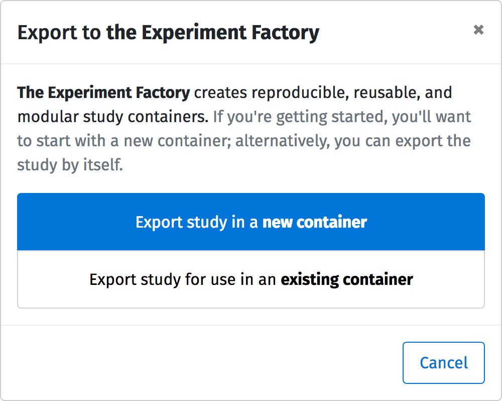

.. _tutorial/deploy/third-party/expfactory:

Reproducible studies with the Experiment Factory
================================================

`The Experiment Factory`_, or "expfactory" for short, is is an open source infrastructure for building and deploying reproducible experiment containers. You can export a ``lab.js`` experiment and build it into a container (or combine multiple experiments, even if they are built with different tools) that is ready for deployment on a webserver with technologies like SSL, and extensive `data collection options <https://expfactory.github.io/expfactory/customize>`_ ranging from flat files to database support.

.. contents:: Steps
  :local:

.. _The Experiment Factory: https://expfactory.github.io

.. seealso::

  The ambition and the powers of `the Experiment Factory`_ go *way beyond* hosting ``lab.js`` studies. Please also check out:

  * Vanessa Sochat's (et al.) papers outlining the vision of `standardizing experiments <https://www.frontiersin.org/articles/10.3389/fpsyg.2016.00610/full>`_ and using `reproducible experiment containers <http://joss.theoj.org/papers/10.21105/joss.00521>`_.
  * Their extensive `library of pre-made paradigms <https://expfactory.github.io/experiments/>`_, all of which are free to use.
  * Their `documentation on integrating <https://expfactory.github.io/expfactory/integration-labjs>`_ with ``lab.js``

.. |clearfloat| raw:: html

  

----

Design and export your experiment
---------------------------------

.. figure:: 3b-expfactory/export.png
   :alt: Expfactory export option
   :figwidth: 40%
   :align: right

After `building your experiment <https://labjs.readthedocs.io/en/latest/learn/builder/index.html>`_ with ``lab.js``, you'll need to export it to the Experiment Factory by selecting the  corresponding bundle from the dropdown menu in the toolbar.

The builder will present you with a pop-up window that allows you to select between exporting the study to a new container or adding it to an existing one. If you're new to ``expfactory``, you'll likely want to select the first option, creating a new container. This will export a ``zip`` archive of all the files you need to plug into the Experiment Factory!

To help you learn and get started, we've provided an `exported example of a Stroop task <https://github.com/expfactory/builder-labjs/blob/master/stroop-task-export.zip>`_ as a ``zip`` file in the repository if you'd rather use a premade study.

In the following, we'll show you how to get this experiment running in an experiment container, but you can go through the exact same steps with your own exported experiment.

|clearfloat|

----

Preparing a container
---------------------

At this point, you should have a ``zip`` file downloaded from the builder. It should include an ``experiments`` directory containing your task, and a ``.circleci`` directory with build instructions. If you don't see this last directory, you might need to check your file manager's settings (because it starts with a dot, Unix systems, Linux and Mac OS might treat it as a hidden folder).

Checking the task metadata
..........................

Just to be sure, please next check the file ``config.json`` in the extracted experiment folder. It will contain further information about your task if you've provided it in the builder interface. Otherwise, please add at least the ``name`` and ``exp_id`` fields, and update the ``time`` to a value in minutes. Here's what the metadata looks like for the Stroop task:

.. code-block:: console

   $ cat experiments/stroop-task/config.json
   {
      "name": "Stroop task",
      "exp_id": "stroop-task",
      "url": "https://github.com/felixhenninger/lab.js/examples/",
      "description": "An implementation of the classic paradigm introduced by Stroop (1935).",
      "contributors": [
        "Felix Henninger <mailbox@felixhenninger.com> (http://felixhenninger.com)"
      ],
      "template": "lab.js",
      "instructions": "",
      "time": 5
   }

Adding more tasks (optional)
............................

You can add any additional tasks you'd like to include in your container by exporting them for use in an existing container, and extracting the resulting ``zip`` file in the ``experiments/[taskname]`` directory. The ``expfactory`` will automatically pick up these tasks in the next step.

If you'd like to add additional `experiments from the library <https://expfactory.github.io/experiments>`_ you could add their names in a single line (separated by spaces) to an ``experiments.txt`` file in the main folder lie so:

.. code-block:: bash

   tower-of-london test-task

If you change your mind, you can add or remove tasks later and go through the following steps to update your container.

----

Building the container
----------------------

We now will recruit the builder to turn our folder into a reproducible experiment container! Guess what? You don't actually need to do any working with Docker (or other) locally! All you need to do is connect your repository to Github and create a container repository on Docker Hub, and then push. Let's review these steps!

 1. Create a container repository on Docker Hub to correspond to the name you want to build
 2. Commit and push the code to Github
 3. Connect the repository to Circle Ci, and
 4. Add this name to the variable ``CONTAINER_NAME``, along with ``DOCKER_USER`` and ``DOCKER_PASS`` to the set of encrypted environment variables in our CircleCI project settings.

Once you've done those steps, that's it! The container will be built and pushed to Docker Hub on each commit.

.. seealso::

  The `expfactory homepage <https://expfactory.github.io>`_ provides far more detailed information regarding the container internals, and also covers several more ways of `generating containers <https://expfactory.github.io/expfactory/generate>`_.

----

Running the study
-----------------

Once your container is deployed, you can run and use it! Read the `Experiment Factory documentation <https://expfactory.github.io/expfactory/usage>`_ to learn of all the ways that you can do this. You can deploy a headless battery, one that is interactive (requiring the experimenter to input an identifier), one with SSL, or use database backends ranging from the filesystem to a postgresql database. Regardless of your choice,
the experiment container that you build, by way of being a container, can be reproducibly deployed and shared.

Here is an example of how you might run the example container that we described here:

.. code-block:: bash

   docker run -d -p 80:80 vanessa/expfactory-stroop start

Where ``vanessa`` is the user who created the container, ``expfactory-stroop`` the container name, and ``80`` the port on which the port on which the webserver is hosting the study. If you open this port on your local machine, you'll see the familiar, the beautiful, the Stroop task -- or any other tasks you've included in your container. From the overview screen, assemble the series of tasks you want your participants to go through, and you're good to go!

.. figure:: 3b-expfactory/stroop.png
   :alt: Expfactory Stroop Task
   :figwidth: 100%

----

Finding help
------------

Do you have a question? You can ask for help `for an experiment <https://www.github.com/expfactory/experiments/issues>`_ or for anything related to the Experiment Factory `software <https://www.github.com/expfactory/expfactory/issues>`_. We can help you with all steps along the way to assemble a `reproducible container <https://github.com/expfactory-containers/>`_ for others to also be empowered to deploy your paradigms.
