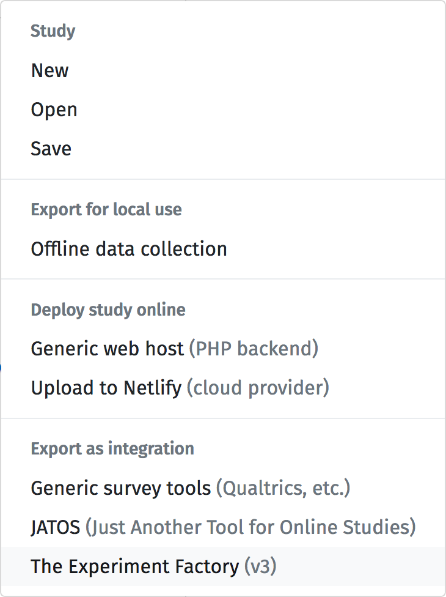
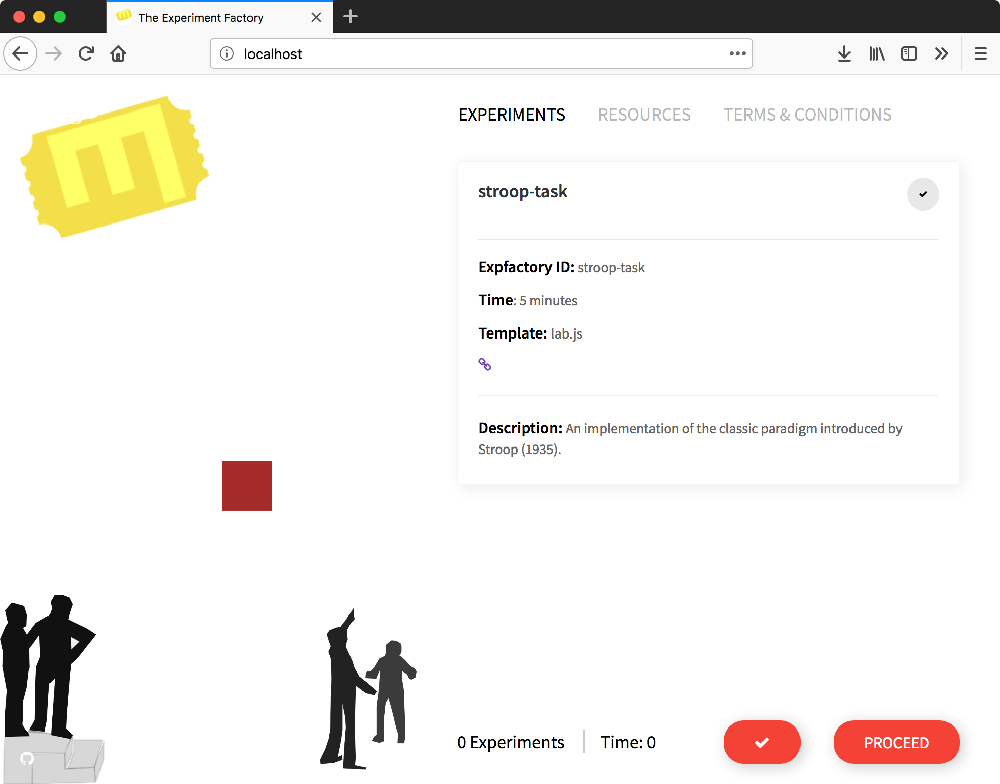

.. _tutorial/deploy/third-party/expfactory:

The Experiment Factory
======================

`The Experiment Factory`_, referred to as "expfactory," is is an open source infrastructure
for building and deploying reproducible experiment containers. You can export a LabJS
experiment (or more than one!) and build it into a container (with other experiments,
not all of which need to be LabJS) that is ready for deployment on a webserver with technologies
like SSL, and databases ranging from filesystem (.json), to sqlite, to postgres and sql. 

.. _Expfactory: https://expfactory.github.io
.. _Documentation: https://expfactory.github.io/expfactory/integration-labjs
.. _Expfactory-LabJS Builder on Github: https://www.github.com/expfactory/builder-labjs
.. contents:: Steps
  :local:

----

Design Your Experiment
-----------------------

Take a look at how to `get started <https://labjs.readthedocs.io/en/latest/learn/builder/index.html>`_ 
with the LabJS builder interface, located at `https://labjs.felixhenninger.com/`_. This
is where you will design your experiment. When you finish, in order to use it with the Experiment
Factory, you can select this export option:

This will export a zip file of all the files needed to plug into the Experiment Factory! To help you learn and get started, we provide an example export of a Stroop task in the `builder-labjs repository`<https://www.github.com/expfactory/builder-labjs>_.  We will walk through the basic steps to get this experiment running in your experiment container, and you can do the same with your own exported experiment.

Create a Repository
-------------------
After working in the browser, you want to export a product that you can put under version control,
and possibly develop collaboratively.

1. Clone the Builder
....................

Let's start by cloning the builder repository. You can also download the archive and extract it. 
The main thing we need is the hidden ``.circleci``
folder that has a configuration file to do the build, so we recommend that you create a copy
to put into your own experiment folder.

.. code-block:: bash
    git clone https://www.github.com/expfactory/builder-labjs
    
    # Create your own experiment folder
    mkdir -p myexperiment
    cp -R builder-labjs myexperiment
    cd myexperiment

You can run ``git init`` again to re-initialize the repository, or edit the ``.git/config``
manually to edit the remote to a repository that you've created. You can also create an 
entirely new folder and just copy the ``.circleci`` folder for the builder template. It's up to you!

2. Export and Extract
.....................

Let's first extract the exported experiment. It will dump the required files into a folder in the present working directory.

.. code-block:: bash
   unzip stroop-task-export.zip
   ls
   stroop-task

   # Move it into experiments folder
   mkdir -p experiments
   mv stroop-task experiments/

3. Define Metadata
..................

Take a look at the ``config.json`` in the extracted experiment folder. It will provide metadata exported about your experiment, and you can customize this if needed before building your container.

.. code-block:: bash

   cat stroop-task/config.json 
   {
      "name": "Stroop task",
      "exp_id": "stroop-task",
      "url": "https://github.com/felixhenninger/lab.js/examples/",
      "description": "An implementation of the classic paradigm introduced by Stroop (1935).",
      "contributors": [
        "Felix Henninger <mailbox@felixhenninger.com> (http://felixhenninger.com)"
      ],
      "template": "lab.js",
      "instructions": "",
      "time": 5
   }

You can now commit, and push the code to your own repository. If you want to share your experiment
(think of it as registering with the Experiment Factory so others can find it) the method to do that for now
is to submit it to the library. You can follow instructions `here <https://expfactory.github.io/expfactory/contribute#the-experiment-repository>`_.

4. Add Additional Experiments (optional)
........................................

If you wanted to add additional experiments from the `library <https://expfactory.github.io/experiments>_
you could add a single line (space separated) to an experiments.txt file in the main folder.

.. code-block:: bash

   tower-of-london test-task

Building
--------

We now will recruit the builder to turn our folder into a reproducible experiment container!
Guess what? You don't actually need to do any working with Docker (or other) locally! All
you need to do is connect your repository to Github and create a container repository on Docker Hub,
and then push. Let's review these steps!

 1. Create a container repository on Docker Hub to correspond to the name you want to build
 2. Commit and push the code to Github
 3. Connect the repository to Circle Ci, and
 4. Add this name to the variable ``CONTAINER_NAME``, along with ``DOCKER_USER`` and ``DOCKER_PASS`` to the set of encrypted environment variables in our CircleCI project settings.

Once you've done those steps, that's it! The container will be built and pushed to Docker Hub on each commit. 

Usage
-----

Once your container is deployed, you can run and use it! Read the `Experiment Factory documentation <https://expfactory.github.io/expfactory/usage>_ to learn of all the ways that you can do this. You can deploy a headless battery, one that is interactive (requiring the experimenter to input an identifier), one with SSL, or use database backends ranging from the filesystem to a postgresql database. Regardless of your choice,
the experiment container that you build, by way of being a container, can be reproducibly deployed and shared.

Here is an example of how you might run the example container that we described here:

.. code-block:: bash

   docker run -d -p 80:80 vanessa/expfactory-stroop start

and you will see the familiar, the beatiful, the stroop task!

