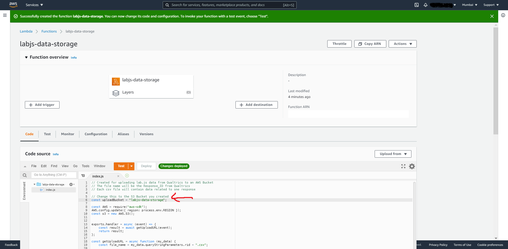

# Storing Data on the Cloud (AWS Lambda + S3 Version)

These are instructions to setup storing your experiment data in an Amazon S3 bucket using a presigned URL and AWS Lambda. At present AWS free tiers offers 1,000,000 invocations of the Lambda function. After the free tier, the S3 bucket will cost around USD 0.10 for storing 10,000 files using around.

Amazon S3 buckets are quite secure and should comply with GDPR for most studies. However, it is best to check with the experts if you have special requirements.

There are three steps in the process:

1. Create and configure an S3 bucket
1. Create and configure a Lambda function
1. Make changes to your survey platform (Qualtrics)

Start by logging into your [AWS console](https://aws.amazon.com/console/). If you don not have an account, you'll need to create one. You will be greeted by this screen:

<br> 

# 1. S3 Bucket

1. Click `Services` (top left). Select `S3` <br> 
2. Click `Create Bucket` <br> 
3. Give the bucket a name, leave everything else as default. Scroll down. Click `Create`.
4. You should now see the bucket if you console, if not, refresh the page.
5. Note the region: the demo shows `Asia Pacific (Mumbai) ap-south-1`, but yours can be something else.
6. Click on the bucket name. Then click the `Permissions` tab. <br> 
7. Scroll Down to the CORS configuration (it should be empty) and click `Edit`. <br> 
8. Paste this into your CORS configuration and click `save changes`
   ```{json}
   [ {
       "AllowedHeaders": [ "*" ],
       "AllowedMethods": [ "GET", "PUT", "POST" ],
       "AllowedOrigins": [ "*" ],
       "ExposeHeaders": []
    } ]
   ```
9. Verify that the CORS config has been changed. <br> 

# 1A. Enable Bucket Versioning (_Optional but Highly Recommended_)

1. We will be using an AWS pre-signed URL to upload the experiment data to the bucket. Since, we can not be certain of the time between the URL generation and the completion of the experiment, this URL will be valid for 1 hour.
1. This URL can not be used to access the data, but will allow anyone to upload data to your bucket with that file name. It is possible that someone may (un)intentionally use the URL later to change the contents of the experiment data. In this case, it is highly recommended that you enable bucket versioning, so that you have access to all versions of the file. You can then use this to match the contents in your survey results to ensure that you have the correct version.
1. Go to your S3 bucket and click on `Properties`. <br> 
1. Under `Bucket Versioning`, if it is disabled, click on `Edit`.
1. Select `Enable` and click `Save Changes`.<br> 
1. Now you'll have access to all versions of the file. <br> 

# 2. Lambda Function

1. Click `Services` (top left). Select `Lambda` <br> 
1. In the Lambda console verify that the region is same as that of the bucket created earlier. If it's not, as shown below, select the appropriate region: `Asia Pacific (Mumbai) ap-south-1` for this demo. <br> 
1. Click `Create function` in the console. <br> 
1. Give the function a name and select `Node.js 14.x` as the runtime. Click `Create function`. <br> 
1. Double click `index.js`. Delete everything in the file.
1. Copy and paste below the code below into your `index.js`.

   ```{JS}

   // Created for uploading lab.js data from Qualtrics to an AWS Bucket
   // The file name will be the Response_ID from Qualtrics
   // Each csv file will contain data related to one response
   // Change this to the S3 Bucket you created const uploadBucket = "YOUR BUCKET NAME HERE";

   const AWS = require("aws-sdk");
   AWS.config.update({ region: process.env.REGION });
   const s3 = new AWS.S3();
   exports.handler = async (event) => {
       const result = await getUploadURL(event);
       return result;
    };
   const getUploadURL = async function (my_data) { const file_name = my_data.queryStringParameters.rid + ".csv";

   var s3Params = {
    	Bucket: uploadBucket,
    	Key: file_name,
    	ContentType: "text/csv",
    };

    return new Promise((resolve, reject) => {
    	let uploadURL = s3.getSignedUrl("putObject", s3Params);
    	resolve({
    		statusCode: 200,
    		isBase64Encoded: false,
    		headers: {
    			"Access-Control-Allow-Origin": "*",
    		},
    		body: JSON.stringify({
    			uploadURL: uploadURL,
    			fileName: file_name,
    		}),
    	});
    });
    };
   ```

1. Change the `bucket name` in the code to the name of your bucket.
1. Then click `Deploy`. <br> 
1. Click on `Add Trigger`.
1. In the Trigger console. Select `API Gateway`. Then select `Create and API`, then `HTTP API`. Keep security as `Open`.
1. Then click on `Additional Settings` and check `CORS`. <br> 
1. Click on `Details` and note the `API endpoint`. We'll need this URL later. <br> 
1. Click on the `Configuration` tab, then click on `Permissions` the click on the role name. <br> 
1. This will open the `IAM Console` in a new tab. Click on `Attach policies` . <br> 
1. Search for `S3`. Select `AmazonS3FullAccess`. Click `Attach Policy` . <br> 
1. Verify that the policy has been attached and then close the tab. <br> 
1. We're done with AWS. You can close the tab.

# 3. Survey Platform (Qualtrics)

1. Login to your survey platform, we'll be using Qualtrics for this demo.
2. Go to your survey flow. Add a `Web Service` element **before** your experiment block. <br> 
3. Select the `GET` method. Paste the `API Endpoint` where it says URL.
4. Click `Add query parameter`. Name it `rid` and set its value to: `${e://Field/ResponseID}`. <br> 
5. Click on `Test`.
6. On the pop-up check both the fields and click `Add Embedded Data`. <br> 
7. Your survey flow should look like this. <br> 
8. Click Apply.
9. In your question JavsScript add this code immediately after `if (event.data.type === "labjs.data") {`

```{JS}
		// Upload the data to your AWS Bucket
		// To keep track of whether data has been uploaded to AWS
        // Create an Embedded Data called "AWS_Upload" in your survey flow
        // It will either be completed or give you the reason for upload failure

		jQuery.ajax({
			type: "PUT",
			url: "${e://Field/uploadURL}",
			data: event.data.csv,
			success: function () {
				Qualtrics.SurveyEngine.setEmbeddedData("AWS_Upload", "completed");
			},
			error: function (err) {
				Qualtrics.SurveyEngine.setEmbeddedData("AWS_Upload", err.status + " " + err.statusText);
			},
		});
```
