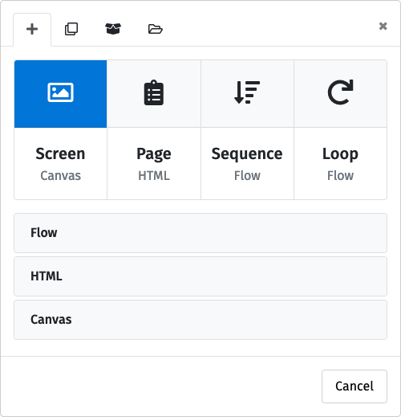
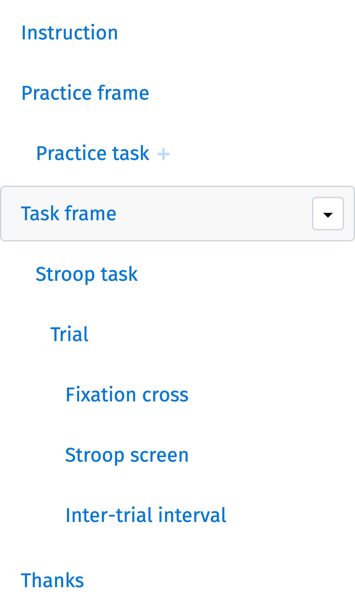

Optimizing for timing performance
=================================

**For many fields of research, accuracy with regard to presentation timing and response time measurement is critical. ``lab.js`` can achieve a very high level of both** if a little care is taken during study construction.

In this document, **we provide actionable guidance for ensuring that your study operates at the highest possible level of performance**. We regularly monitor the `timing characteristics of our software`_ and provide our benchmark results online. We also strongly encourage you to measure the performance of your study if timing is critical to your research, and are happy to assist with assessment and optimization. That being said, the steps described in the following should get you very close to an optimum level of performance. Here are our recommendations:

.. _timing characteristics of our software: https://lab.js.org/resources/performance/

.. |clearfloat| raw:: html

  

----

Use canvas-based screens where possible
---------------------------------------

For optimal performance, our first recommendation is to **use the canvas-based screens** that are designed using the visual builder interface for presentation.

This is because, compared to ``HTML``-based stimuli, these take load off the browser by reducing the need for computing complex layouts on the fly (which is necessary for ``HTML``), instead allowing ``lab.js`` to preload screens ahead of time so that they can be displayed as efficiently as possible.

``HTML``-based screens absolutely have their place in your toolbox: They are the most adaptable type of screen, and extremely helpful for formatting questionnaires and text-based screens such as instructions. However, **for fast-paced stimuli, we recommend using canvas-based screens.**

|clearfloat|

----

Add frames around performance-critical parts of the study
---------------------------------------------------------

Our second recommendation is to **place frames around fast-paced, performance-critical parts of the study**. In most cases, this is easily achieved by inserting a frame around the trial loop, as illustrated in the figure to the right.

Frames further increase performance by reducing changes to the page content, ensuring that only the relevant parts of the screen are updated when its content changes.

|clearfloat|

----

Unroll unnecessary loops
------------------------

As a final recommendation to achieve the utmost performance, we recommend **unrolling loops so that timing-critical transitions do not take place in-between loop iterations**. The vast majority of studies do not require this, but it is worth checking just in case.

In most if not all experiments, the technical structure of the study corresponds to the natural progression of stimuli. For example, in the Stroop Task pictured above, timing is most critical on the `Stroop screen` and in the progression from `fixation cross` to `stimulus` and finally to the `inter-trial interval`. Because these are part of the same sequence, ``lab.js`` knows to optimize transitions between these immediately subsequent screens, and will provide maximum timing accuracy inside of the trial sequence, while allowing for some potential slack between trials.

You might be tempted to spread a set of subsequent stimuli across multiple loop iterations. For example, you might use a loop to repeatedly present a single screen while varying its color. In this case, subsequent screens are not immediately adjacent in the study timeline, but broken across multiple loop iterations.
Because switching from one iteration to the next incurs a slight overhead, these **breaks may lead to slight delays in stimulus presentation**. This potential delay between loop iterations is a well-known issue in computer science, as is its solution, unrolling loops. **Unrolling means to take stimuli that were previously split across iterations of a loop, and placing them in direct succession.** Following the above example, our recommendation would be to convert the loop into a string of individual screens with varying contents. That way, all screens will be placed in immediate succession, and delays will be minimized.

.. note::
  This is a temporary measure, and **we are actively working to improve cross-iteration performance**. Stay tuned, and remember to unroll where necessary in the meantime!
