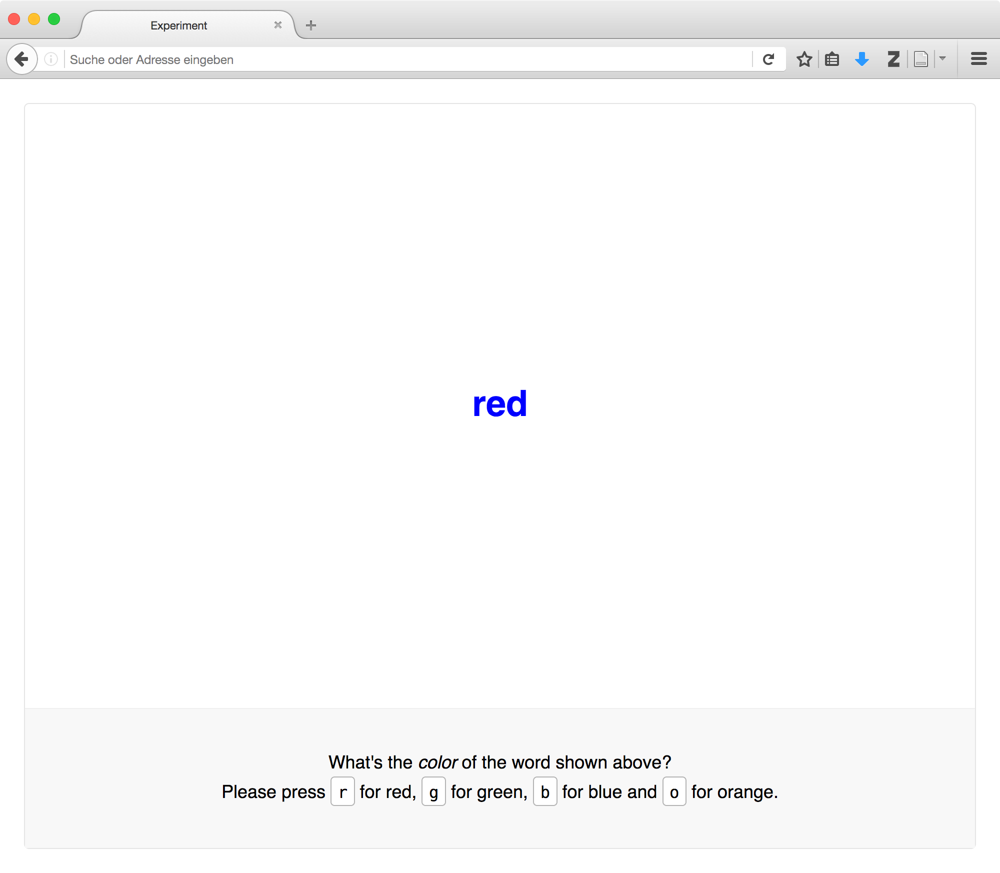

Building a working study
========================

.. note::
  **This documentation page is currently under development. Sorry for that!**

  We're actively working on this, so there might be parts that are missing or
  incomplete. Please be invited to start with the tutorial nonetheless,
  the additional parts are coming very soon.

  If you find something awry or missing content, please don't hesitate to send
  us a line or two, we're happy to explain things further or to give you a
  personal tutorial via Skype/Hangouts/etc. or in person.

  Sorry for the trouble!

.. raw:: html

  

.. role:: blue

**This is where we build our first working study!** Specifically, we're going to
create an experiment that demonstrates the *Stroop effect*. This effect
describes the interference between a written word's content and its visual
characteristics: `John Ridley Stroop <https://en.wikipedia.org/wiki/John_Ridley_Stroop>`_
demonstrated that naming the color of a word is harder (takes longer) when the
word denotes a different color. An example for such an *incongruent* display
might be the word :blue:`red`. Conversely, in the word and color can correspond
(be *congruent*), which makes the task easier.

Picking back up
---------------

This section builds on the previous one, in which you `downloaded the starter
kit <https://github.com/FelixHenninger/lab.js/releases>`_ and took at first look
how a minimal 'experiment' was constructed from individual components. You also
made the code run by adding or uncommenting ``experiment.run()``. We'll build
upon the same code, so please make sure you have the files and an editor handy.

If didn't go through the initial steps and don't feel confident looking at the
starter kit code, please go back and take a quick look. You're always welcome to
`reach out if you need help <https://github.com/FelixHenninger/lab.js#find-help>`_
right now or in any of the following steps.

With that, let's get going!

Thinking about a study's structure
----------------------------------

**When we build our studies, we'll think about them in a particular way: As a
sequence of individual building blocks. What does that mean?**

Every *component* performs a particular function -- it might show some
information onscreen, play a sound, or do some processing in the background.
Each component *prepares*, often at the beginning of the experiment, readying
for its task, and will *run* later, to perform its main function.

.. figure:: study/2-component-timeline.svg
   :alt: Individual component timeline
   :figwidth: 100%
   :width: 100%
   :align: center

As just noted, every component's moment in the spotlight is when it runs. This
will very often mean showing some information, and then waiting for a response.
A typical experiment will consist of many such components strung together like
this:

.. figure:: study/3-multiple-components.svg
   :alt: Multiple components in sequence
   :figwidth: 100%
   :width: 100%
   :align: center

When we build experiments, components will not only be responsible for
presenting stimuli and collecting responses. We will use different components to
tie the structure of our experiment together. For example, the stimuli above are
shown sequentially, and therefore together constitute a *sequence*.
Accordingly, we'll use a *sequence component* to group them together.

.. figure:: study/4-sequence.svg
   :alt: Components nested in a sequence
   :figwidth: 100%
   :width: 100%
   :align: center

In many ways, a sequence component behaves exactly as a standard component
would: It prepares by signaling all nested components to prepare themselves,
and it runs by running them in sequence.

A sequence differs from a stimulus component in that it does not provide any new
information to the viewers. Instead, it is in charge of *flow control*: It makes
sure that other components run when they are supposed to. These *nested
components* can then do the actual work of presenting information, or they might
themselves organize the flow of yet another set of components.

We'll always combine both types, presentational components and flow control
components, to build studies.
