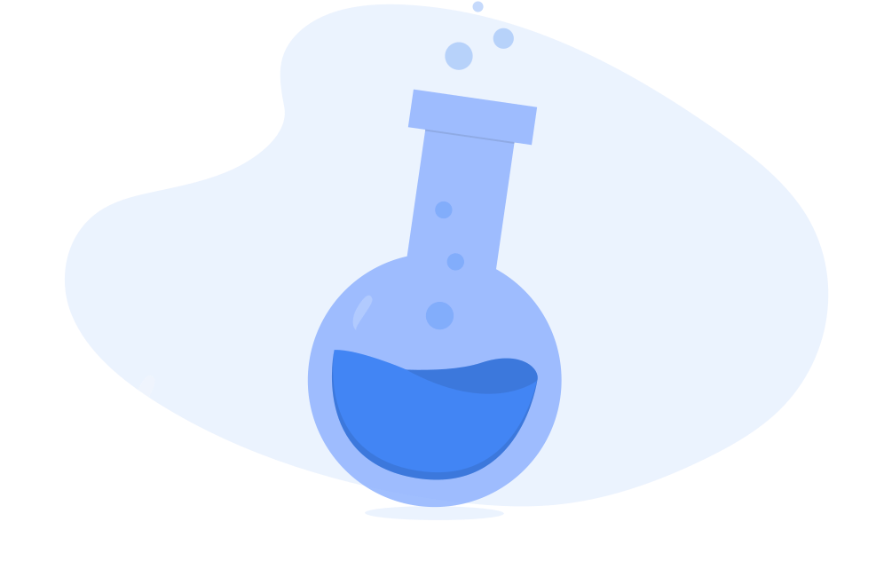
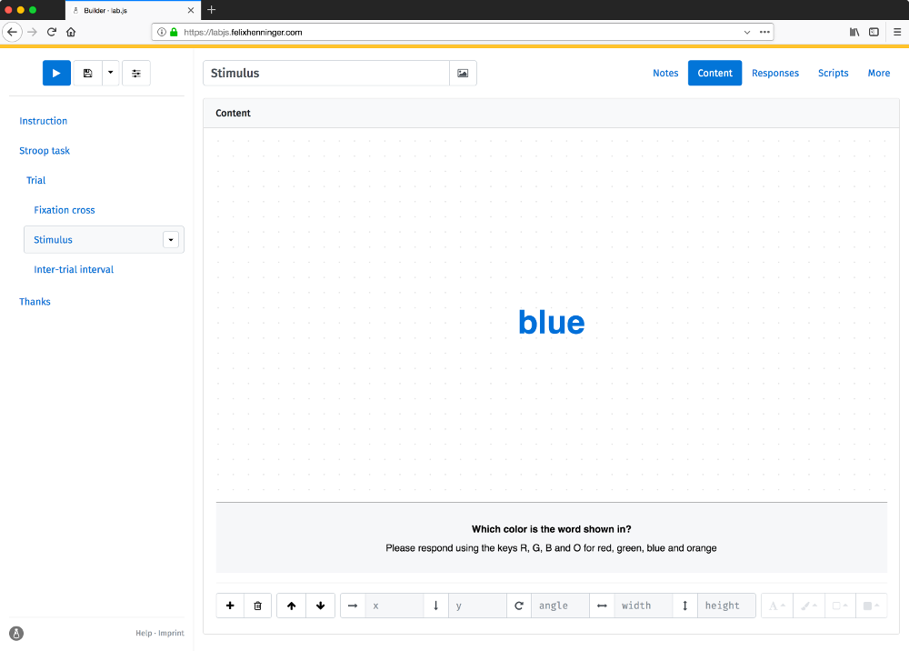
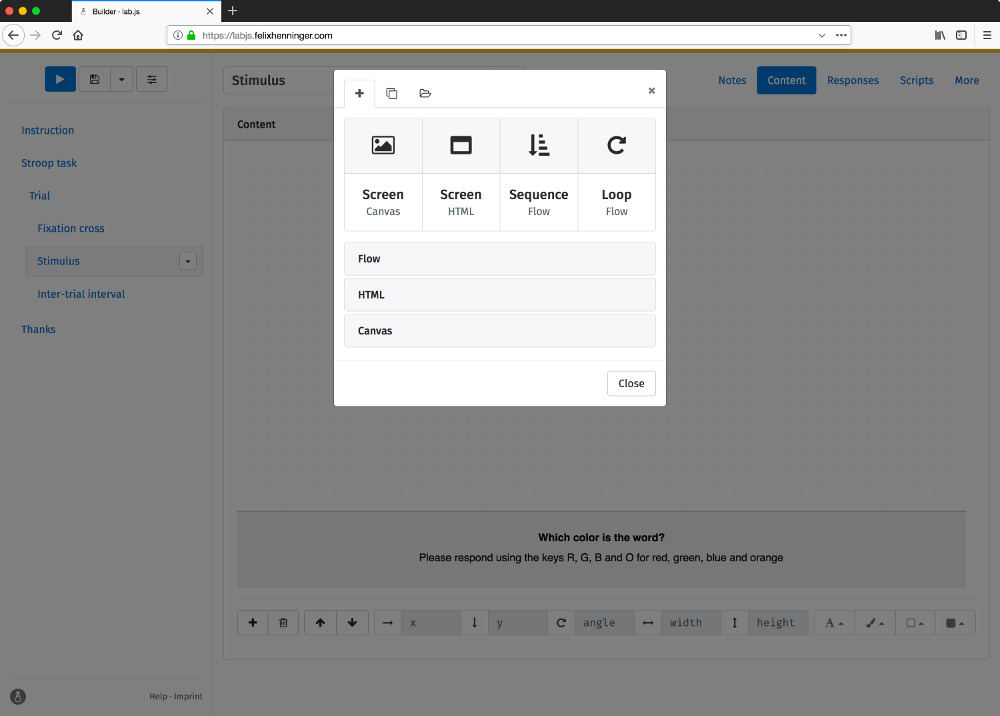
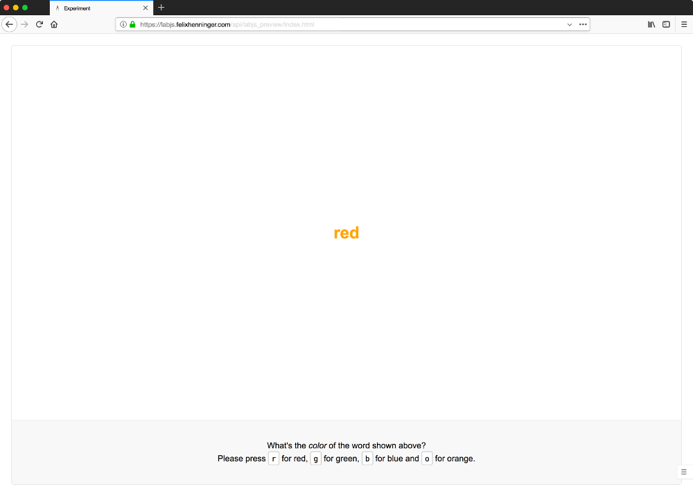

+++
title = "A free, open, online study builder"
description = "lab.js makes it easy to build powerful studies for the neuro- and behavioral sciences"
+++


  

    

      

        
      

      

        <h2 class="display-4 mb-4">
          Online research made easy
        </h2>
        

          <strong>
            <code>lab.js</code> is a free, open, online study builder
          </strong> 
          for the behavioral and cognitive sciences. 
          
            (it works great in the lab, too)
          
        

      

    

  




  

    

      

        
      

      

        

          <h3 class="h4"><strong>No code</strong> required</h3>
          
<strong><code>lab.js</code> provides a visual interface</strong> 
          so you can see the study as you build it.

          
Thanks to our <strong>ready-made templates</strong>, 
          constructing studies couldn't be easier.

        

      

    

  




  

    

      

        <i
          class="fas fa-stopwatch fa-fw fa-10x text-muted"
          style="transform: rotate(-15deg)"
        ></i>
      

      

        

          <h3 class="h4"><strong>Uncompromising</strong> performance</h3>
          
The power of laboratory software, 
          anywhere there's a browser.

        

      

    

  




  

    

      

        <i
          class="fas fa-plug fa-fw fa-10x text-light"
          style="transform: rotate(20deg)"
        ></i>
      

      

        

          <h3 class="h4"><strong>Flexible</strong> and extensible</h3>
          
There are <strong>no limits</strong>: 
          If it's possible on a web page, 
          you can do it in a study.

          
<code>lab.js</code> supports your workflow, 
          whether you're collecting data offline, 
          using external data collection services, 
          or running studies on your own server.

        

      

    

  




  

    

      

        
        <small class="text-muted">Studies are assembled from individual <em>components</em> ...</small>
      

      

        
        <small class="text-muted">... for example <em>loops</em>, which repeat parts of a study ...</small>
      

      

        
        <small class="text-muted">... an <em>immediate preview</em> shows changes immediately.</small>
      

    

  




  

    

      

        

          <h2 class="mt-0 mb-1" style="font-weight: 400">There's <em>so</em> much more!</h2>
          
Here are some things you can try:

          <ul>
            <li>Learn how <code>lab.js</code> can help you with your <a href="/for/research">research</a> and <a href="/for/teaching">teaching</a>.</li>
            <li>Try the <a href="https://labjs.felixhenninger.com" target="_blank" rel="noopener">builder interface</a> online.</li>
            <li>Watch our <a href="https://labjs.readthedocs.io/en/latest/learn/builder/" target="_blank" rel="noopener">introductory tutorial</a> and build your first study in minutes.</li>
          </ul>
        

      

      

        

        <h3 class="d-lg-none mt-1 mb-4" style="font-weight: 400">Further resources</h3>
        

          

            <h5 class="mt-0 mb-1">Support</h5>
            You'll always find friendly people in our <a href="https://slackin-nmbrcrnchrs.herokuapp.com/" target="_blank" rel="noopener"><strong>Slack channel</strong></a>. We're happy to help!
          

          <i class="ml-3 fas fa-life-ring fa-fw"></i>
        

        

          

            <h5 class="mt-0 mb-1">Example studies</h5>
            <code>lab.js</code> comes with templates for many common paradigms. 
            Check out our gallery and get a head start!
          

          <i class="ml-3 fas fa-box-open fa-fw"></i>
        

        

          

            <h5 class="mt-0 mb-1">Workshops</h5>
            Learning to build studies is most fun in a group. 
            We offer workshops tailored to your lab's research.
          

          <i class="ml-3 fas fa-graduation-cap fa-fw"></i>
        

        

          

            <h5 class="mt-0 mb-1">Consulting</h5>
            Whether you're in a hurry or looking for a custom study, 
            we'll find an expert to help you. Please get in touch!
          

          <i class="ml-3 fas fa-hands-helping fa-fw"></i>
        

      

    

  


