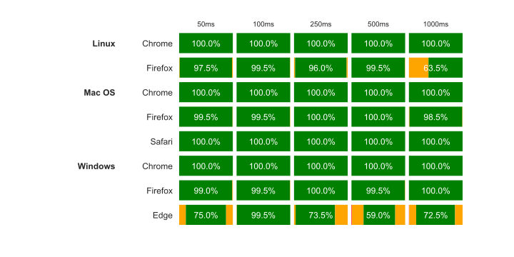
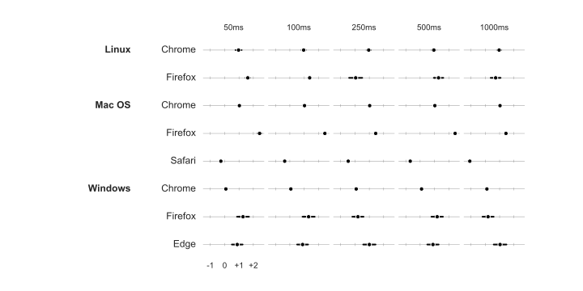

+++
title = "Performance"
weight = 2
+++



  

    

      <i
        class="fas fa-stopwatch fa-fw fa-10x"
        style="transform: rotate(-15deg)"
      ></i>
    

    

      <h1>Timing performance</h1>
      

        For many research areas, timing of both stimulus presentation and response latencies is vital.
      

      

        <code>lab.js</code> aims to offer the best possible performance with regard to both.
      

    

  





  As experimentalists, precise timing is important to us. Therefore, we conduct extensive timing validation studies, following the procedure described in <a href="../publications">our paper</a>.

----

  

    <h3 class="mb-3">Presentation timing</h3>
    
On modern browsers, <code>lab.js</code> consistently meets presentation times across browsers and operating systems.

    
As the figure to the rightbelow shows, a wide range of presentation times are overwhelmingly met in our tests with external measurement equipment. Chrome in particular showed excellent presentation timing performance across operating systems. Deviations, if they occured, were largely limited to a single frame (shown in orange).

  

  

    
  

  

    <h3 class="mb-3">Response time measurement</h3>
    
As a general observation, recorded response times in <code>lab.js</code> overestimate response latencies by one frame (16.66 milliseconds), with very little measurement noise.

    
The degree of overestimation depends on the operating system and browser involved. In particular, Chrome on Windows appears to be consistently spot-on with recorded reponse times.

  

  

    
  


