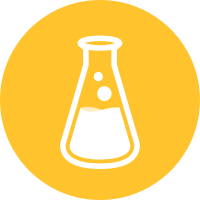
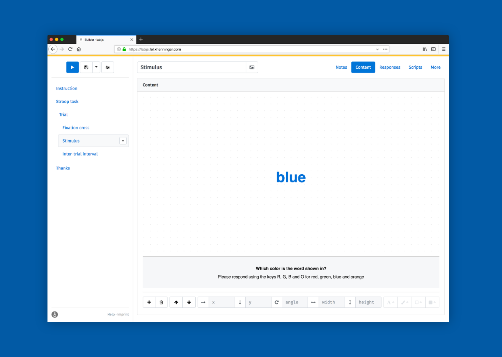

  
  <h1>lab.js</h1>

  <small>
    <a href="https://labjs.readthedocs.io/en/latest/learn/builder">Get started</a> ·
    <a href="https://labjs.felixhenninger.com/">Open the builder</a> ·
    <a href="https://labjs.readthedocs.io/en/latest/">Learn more</a> ·
    <a href="https://labjs.readthedocs.io/en/latest/meta/contribute/index.html">Contribute</a>
  </small>

**`lab.js` makes it easy to build, conduct and share studies in the behavioral and cognitive sciences.** It allows everyone to construct and run experiments and surveys within the browser; the graphical builder makes it easy to get started without writing code.

  

----

### Get started 🚀

The [**graphical builder interface**](https://labjs.felixhenninger.com) is the
easiest way to create studies, and the best place to start. The tutorial
will walk you through [building your first study, step by
step](https://labjs.readthedocs.io/en/latest/learn/builder/).

If you prefer working directly with code, you can build studies using the
[**JavaScript library**](https://labjs.readthedocs.io/en/latest/reference/).
Everything you need is bundled in the *starter kit*, which is [provided with
every release](https://github.com/FelixHenninger/lab.js/releases/latest).
There is also a tutorial to [help you get started](https://labjs.readthedocs.io/en/latest/learn/code/).

If you get stuck or things don't make sense, please don't hesitate to reach out!

### Find help ☎️

The easiest and quickest way to find help is to [join our **Slack
channel**](https://slackin-nmbrcrnchrs.herokuapp.com/), where there's someone
around to discuss things and help out most of the time. You're welcome to just
join and say hello, we'd love to have you around!

### Keep up-to-date 📮

If you'd like to keep in the loop regarding the development, please [subscribe
to our **newsletter**](http://eepurl.com/co0K9r) to receive very occasional
updates and release notifications.

### Help improve `lab.js`! ✨☀️

**We would love to have you as part of this project!** There are lots of
different [**ways to contribute**](https://labjs.readthedocs.io/en/latest/meta/contribute/ways.html),
and we recognize and very warmly welcome all kinds of involvement:

* **Feedback, ideas and suggestions** are always appreciated. If we can make `lab.js` more useful, we'd love to!
* If you've found something that didn't work, felt harder than it should, or figured out a trick, it's likely that others will benefit from your experience. Please [**file an issue**](https://github.com/FelixHenninger/lab.js/issues/new) that describes what's going on, or **contribute a brief recipe** to the documentation.
* We wholeheartedly invite fellow scientists and students to **share your studies**: Chances are that others are trying something very similar — by sharing yours, you'll be giving other researchers a head start. We'll happily help you polish your study if you'd like.
* Of course, **code contributions** are hugely welcome! If you're missing something, we'd love to work with you to extend the project. If you're looking for an area to contribute, [let us know](#find-help), or [check out the issues](https://github.com/FelixHenninger/lab.js/issues) for some ideas — we'd love to support you and help you get started, regardless of your skill level: **We are all learners**.

**Please also let us know if you'd like to join in but are unsure how**, we'd be
thrilled to help you find something that suits your interests and resources.
The [**contributor's guide**](contributing.md) provides further information
about our process; we have some pointers regarding how to [build the project](https://labjs.readthedocs.io/en/latest/meta/contribute/build.html)
in the documentation.

----

### Contributors ❤️

(in alphabetical order)

#### Code / documentation 🔬

[Felix Henninger](http://felixhenninger.com) ·
[Pascal J. Kieslich](https://pascalkieslich.github.io/) ·
[Ulf K. Mertens](http://www.psychologie.uni-heidelberg.de/ae/meth/team/mertens/) ·
[Yury Shevchenko](http://yuryshevchenko.com/) ·
[Vanessa Sochat](https://vsoch.github.io/)

#### Ideas, feedback and examples 💡

[Emily Elliott](https://lsu.edu/hss/psychology/faculty/cognitive/elliott.php) ·
[Jeffrey Fisher](https://github.com/jeffslofish) ·
[Robert Gaschler](https://www.fernuni-hagen.de/psychologie/psychologisches_institut/about_institute/departments/app_lme/staff/rgaschler/) ·
[Benjamin E. Hilbig](https://cognition.uni-landau.de/hilbig) ·
Michael Kriechbaumer ·
Felix Ludwig ·
[Karthikeya Pammi](https://github.com/pvskarthikeya) ·
[Sophie Scharf](http://cognition.uni-mannheim.de/mitarbeiter/m_sc_sophie_scharf/) ·
[Merle M. Schuckart](https://github.com/MMarieSchuckart) ·
[Hendrik Singmann](http://singmann.org) ·
[Andrew White](https://github.com/shiroandy) ·
[Malte Zimdahl](http://psycho3.uni-mannheim.de/Personen/Malte%20Zimdahl,%20M.Sc./) ·

The students and teaching assistants in the graduate course *Research Methods
in Cognitive Psychology* at the University of Koblenz-Landau inspire the
continued development of this software, have provided countless valuable
insights, and sparked many of the ideas embodied in this project through
questions and discussions.

#### Sponsors and supporters 🎩

We are wholeheartedly grateful to our generous sponsors for making possible the
development of this tool:

[FernUniversität in Hagen](https://www.fernuni-hagen.de/psychologie/psychologisches_institut/about_institute/departments/app_lme/) ·
[GESS, University of Mannheim](http://gess.uni-mannheim.de/) ·
[Rational Altruists Mannheim](http://www.ram-ev.de/) ·
[University of Koblenz-Landau](https://www.cognition.uni-landau.de/)

If you would like to support development as a scientific institution, the
easiest way is to **host a workshop**. We'll gladly show you and your
colleagues how to build experiments using this software, and build your
favorite paradigm together! We are also open to **consulting** if you are
looking for a particular feature — please don't hesitate to get in touch so
that we can discuss things in more detail.

----

### Citation 📓

We [kindly request](https://www.youtube.com/watch?v=kVwl-Va7cNM) that you cite
``lab.js`` if you use it in your research. Here's how:

> Henninger, F., Mertens, U. K., Shevchenko, Y., & Hilbig, B. E. (2018). lab.js: Browser-based behavioral research. doi: [10.5281/zenodo.597045](https://doi.org/10.5281/zenodo.597045)

(There are also [version-specific dois](https://doi.org/10.5281/zenodo.597045) if you prefer those)

----

### License 👩‍⚖️

All parts of this project are openly available, subject to different licenses:

* The `lab.js` **core library** that is included in your studies is made
  available under the terms of the [Apache License](/packages/library/license).
* The **builder**, the graphical interface used to build experiments,
  is provided under the terms of the [GNU Affero General Public
  License](/packages/builder/license).

The studies you build based on the library, and those you create using the
builder, are always your own, and you are free to distribute them as you see
fit. When studies include the core library files, these files alone are governed
by the aforementioned license.
